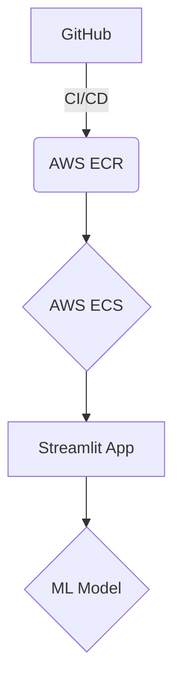

# 🚲 Bike Sharing Demand Prediction


***

## 📈 Business Context

Public bike-sharing systems in cities like Seoul help reduce traffic congestion, cut pollution, and promote sustainable transport.  
However, their success depends on **matching bike availability with fluctuating demand**.  
Too many bikes lead to wasted resources, while shortages frustrate users and reduce trust.

Accurate demand forecasting using historical usage, weather, and time-based data enables operators to:

- ✅ Ensure bikes are available when and where needed  
- 💰 Reduce operational costs  
- 😊 Improve user satisfaction and loyalty  

By adopting a **data-driven forecasting approach**, bike-sharing providers can shift from reactive allocation to proactive, efficient fleet management, ensuring consistent service and higher profitability.

***

## 🧭 Problem Statement

Urban centers like **Seoul** are experiencing rapid adoption of public bike-sharing systems to address:

- 🚗 Traffic congestion  
- 💨 Pollution reduction  
- 🌿 Sustainable transportation promotion  

However, these systems face a critical challenge:  

> **How do we ensure the right number of bikes are available at the right time and location to meet dynamic user demand?**

### 📉 Without accurate forecasting:
- 🚲 Bikes sit idle during low demand, wasting resources  
- ⏳ Users face unavailability during rush hours, lowering satisfaction  

### 📌 Objective
Build an end-to-end ML pipeline that can forecast hourly demand for rented bikes, using historical rental records combined with weather and temporal data.

***

## 📊 Exploratory Data Analysis (EDA) Insights

Key insights derived from the exploratory data analysis:

### 📝 Data Overview
*   The dataset contains hourly bike rental counts along with weather and holiday information for one year (December 2017 to November 2018).
*   No missing or duplicate values were found, indicating a clean dataset for analysis.

### 📉 Distribution of Variables
*   The target variable, `rented_bike_count`, exhibits a right-skewed distribution, suggesting that lower bike rental counts are more frequent, with fewer instances of very high demand.
*   `Temperature`, `dew_point_temp`, and `Humidity` are approximately normally distributed.
*   `Wind speed`, `solar_radiation`, `rainfall`, and `snowfall` show right-skewed distributions, with outliers representing extreme weather conditions (e.g., high winds, heavy precipitation) which are naturally less common.
*   `Visibility` is left-skewed, indicating that high visibility is more common.

### 📈 Relationships with Bike Rental Demand
*   **Hourly Patterns**: Bike rental demand is significantly lower during early morning hours (0-5 AM) and peaks during morning (8-9 AM) and evening (5-7 PM) rush hours, aligning with typical commuting patterns.
*   **Temperature**: A strong positive correlation exists; as temperature increases, bike rental demand generally rises.
*   **Humidity**: An inverse relationship is observed; higher humidity levels tend to correlate with lower bike rental counts.
*   **Wind Speed**: Increased wind speeds are generally associated with decreased bike rental demand.
*   **Seasons**: Summer and Spring experience the highest bike rental counts, while Winter records the lowest demand, highlighting the impact of seasonal weather on usage.
*   **Holiday vs. Non-Holiday**: Non-holiday periods consistently show significantly higher bike rental activity compared to holidays.
*   **Functioning Day**: Bike rental counts are zero on non-functioning days, as expected.
*   **Precipitation (Rainfall/Snowfall)**: High rainfall and snowfall events drastically reduce bike rental demand.
*   **Solar Radiation**: Higher solar radiation generally corresponds to increased bike rental counts, indicating a preference for sunny conditions.

These insights are crucial for feature engineering and model development, helping to identify the most influential factors affecting bike-sharing demand.

***

## ✨ Features

*   **Data Ingestion**: 📥 Automates the process of fetching and preparing raw data, ensuring a consistent and reliable input for the pipeline.
*   **Data Validation**: 🛡️ Implements rigorous checks to maintain data quality, identifying and handling missing values, duplicates, and schema inconsistencies.
*   **Data Preprocessing**: ⚙️ Transforms raw data into a clean, normalized, and feature-rich format, optimizing it for model training through techniques like feature cleaning, engineering, and scaling.
*   **Model Training**: 🚀 Develops and trains a high-performance machine learning model capable of accurately predicting bike sharing demand.
*   **Model Evaluation**: 📊 Provides comprehensive evaluation of the model's performance using key metrics and visualizations, ensuring its reliability and effectiveness.
*   **DVC Pipeline**: 🔗 Ensures reproducibility and version control for the entire machine learning workflow, from data acquisition to model deployment, making experiments traceable and collaborative.
*   **MLflow Integration**: 📈 Facilitates experiment tracking, model management, and reproducible runs, enabling efficient iteration and comparison of different model versions.
*   **Streamlit App**: 🌐 Offers an intuitive and interactive web interface for users to explore predictions and interact with the deployed model.
*   **Docker Deployment**: 🐳 Containerizes the application for seamless and consistent deployment across various environments, eliminating dependency issues.
*   **CI/CD with GitHub Actions**: 🔄 Automates the build, test, and deployment processes, ensuring rapid and reliable delivery of updates and new features.

***

## 🏗️ Architecture

### High-Level Architecture



### Low-Level Architecture

The project's low-level architecture can be broken down into three main flows:

1.  **CI/CD Pipeline (GitHub Actions)**:
    *   **Push to main**: Any code push to the `main` branch triggers the CI/CD pipeline.
    *   **Build & Push Docker Image**: A Docker image containing the Streamlit application and the trained ML model is built and pushed to AWS Elastic Container Registry (ECR).
    *   **Deploy to AWS ECS**: The updated Docker image is then deployed to AWS Elastic Container Service (ECS), ensuring the application is always running with the latest code.

2.  **Application Flow (Streamlit & AWS)**:
    *   **User Input**: Users interact with the Streamlit web application through a user-friendly interface.
    *   **Streamlit App**: The Streamlit application processes user requests and sends them to the underlying ML model for prediction.
    *   **ML Model (Prediction)**: The deployed machine learning model performs real-time bike demand predictions based on the input received from the Streamlit app.
    *   **Loads Model From AWS S3 (Served Models)**: The ML model loads its trained parameters and artifacts from a dedicated S3 bucket, ensuring that the latest and most accurate model is always used for predictions.

3.  **ML Pipeline (DVC & AWS S3)**:
    *   **AWS S3 (Raw Data)**: Raw bike-sharing demand data is stored and versioned in an AWS S3 bucket.
    *   **Data Ingestion & Preprocessing**: The DVC pipeline initiates data ingestion from S3, followed by comprehensive data preprocessing steps (cleaning, feature engineering, scaling).
    *   **Model Training & Evaluation**: The preprocessed data is then used to train the machine learning model, which is subsequently evaluated for performance and accuracy.
    *   **Stores Artifacts to AWS S3 (Trained Models/Artifacts)**: All trained models, evaluation metrics, and other relevant artifacts are securely stored and versioned in another AWS S3 bucket, ensuring reproducibility and traceability of experiments.

    The trained models and artifacts stored in the ML Pipeline's S3 bucket are then made available to the Application Flow for serving predictions.

***

## 🚀 Deployment

The application is deployed to AWS using a CI/CD pipeline with GitHub Actions. When code is pushed to the `main` branch, the following steps are executed:

1.  **Build Docker Image**: A Docker image is built containing the Streamlit application and the trained model.
2.  **Push to AWS ECR**: The Docker image is pushed to a private repository in Amazon Elastic Container Registry (ECR).
3.  **Deploy to AWS ECS**: The application is deployed to Amazon Elastic Container Service (ECS) as a Fargate task, which runs the Docker container.

***

## 📈 Model Performance

The trained model demonstrates strong predictive capabilities on unseen data. The following metrics were obtained during the evaluation phase:

```
+-------------+---------------------+
|    Metric   | Test (Actual Scale) |
+-------------+---------------------+
|   R2 Score  |        0.9245       |
| Adjusted R2 |        0.9215       |
|     MSE     |      30536.728      |
|     RMSE    |       174.7476      |
|     MAE     |       95.2794       |
+-------------+---------------------+

```

These results indicate that the model explains approximately 92% of the variance in bike demand, with a mean absolute error of around 95 units, demonstrating its effectiveness in real-world scenarios.

***

## 🛠️ Technologies Used

*   **Python**: Core programming language.
*   **DVC (Data Version Control)**: For MLOps, data and model versioning, and pipeline management.
*   **MLflow**: For experiment tracking, model registry, and reproducible runs.
*   **Scikit-learn**: For machine learning models and utilities.
*   **LightGBM & XGBoost**: Gradient boosting frameworks for model training.
*   **Pandas & NumPy**: For data manipulation and numerical operations.
*   **Streamlit**: For building interactive web applications.
*   **Docker**: For containerization and deployment.
*   **AWS (ECR, ECS)**: For cloud deployment infrastructure.
*   **GitHub Actions**: For Continuous Integration and Continuous Deployment (CI/CD).
*   **Mermaid**: For diagramming in Markdown.

***

## 🚀 Getting Started

### Initial Setup

Before running the project, ensure you have the necessary data and that the project structure is correctly set up.

1.  **Data Acquisition**:
    This project relies on the `bike_sharing_data.csv` dataset. This file is not included in the repository due to its size and to keep the repository clean. Please obtain the dataset and place it in the `data/raw/` directory.

2.  **Directory Structure**:
    The project is designed to automatically create necessary directories (e.g., `data/processed`, `data/interim`, `artifacts`, `logs`, `S3/files`, `mlruns`) upon execution, thanks to the configurations in `src/utils/config.py`. You do not need to manually create these folders.

3.  **Install Dependencies**:
    Ensure all required Python packages are installed. It's recommended to use a virtual environment.
    ```bash
    pip install -r requirements.txt
    ```
    Alternatively, if you prefer using `pyproject.toml`:
    ```bash
    pip install .
    ```

4.  **Run DVC Pipeline**:
    After setting up the data and installing dependencies, run the DVC pipeline to process data, train the model, and generate artifacts.
    ```bash
    dvc repro
    ```

## 💻 Usage

1.  Run the DVC pipeline:
    ```bash
    dvc repro
    ```
2.  Build and run the Docker container:
    ```bash
    docker build -t bike-sharing-app .
    docker run -p 8501:8501 bike-sharing-app
    ```
3.  Open your browser and navigate to `http://localhost:8501` to use the Streamlit app.

***

## 📂 Project Structure

```
.
├── .dockerignore
├── .dvcignore
├── .gitattributes
├── .gitignore
├── Bike_Sharing_Demand_Predictionn.ipynb
├── Dockerfile
├── dvc.lock
├── dvc.yaml
├── params.yaml
├── pyproject.toml
├── README.md
├── requirements_docker.txt
├── requirements.txt
├── streamlit_app.py
├── .dvc/
│   ├── .gitignore
│   ├── config
│   ├── config.local
│   ├── cache/
│   │   └── ... (contains DVC cache files)
│   └── tmp/
│       └── ... (contains DVC temporary files)
├── .git/
│   └── ... (Git repository files)
├── .github/
│   └── workflows/
│       └── aws.yaml
├── .venv/
│   └── ... (Python virtual environment)
├── artifacts/
│   ├── data/
│   ├── models/
│   └── pipelines/
├── data/
│   ├── interim/
│   ├── processed/
│   └── raw/
├── logs/
├── mlruns/                # MLflow experiment tracking logs
├── S3/                    # Local directory for simulating S3
└── src/
    ├── __init__.py
    ├── components/
    │   ├── __init__.py
    │   ├── data_ingestion.py
    │   ├── data_preprocessing.py
    │   ├── data_validation.py
    │   ├── model_evaluation.py
    │   ├── model_prediction.py
    │   ├── model_training.py
    └── utils/
        ├── __init__.py
        ├── aws_config.py
        ├── config.py
        ├── logger.py
        ├── params.py
        ├── predictor.py
```

***

## 🙌 Contributing

Contributions are welcome! Please feel free to submit a pull request.

***

## 📜 License

This project is licensed under the MIT License.